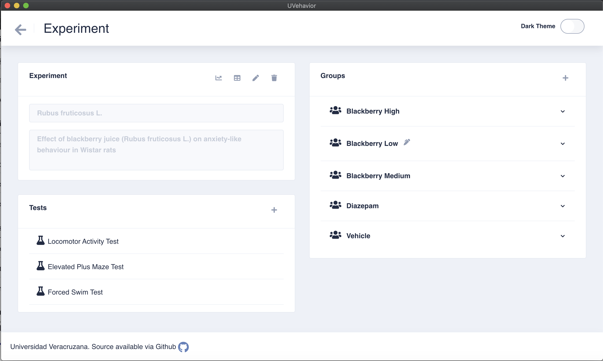

<h1 align="center">
  <br>
  
  <br><br>
</h1>

<p align="center">
  <a href="https://lgtm.com/projects/g/Manolomon/uvehavior-desktop">
    
  </a>
  <a href="https://travis-ci.org/github/Manolomon/uvehavior-desktop/builds">
    
  </a>
  <br>
  <a href="https://app.fossa.com/api/projects/git%2Bgithub.com%2FManolomon%2Fuvehavior-desktop.svg?type=shield">
    
  </a>
  
  
  </br>
  
</p>

## About


UVehavior is a cross-platform annotation tool for the behavioral analysis. By assisting in several of the activities in Neuroethology, researches are able to plan, conduct and analyse results in behavioral science. For detailed usage, refer to the [repository wiki](https://github.com/Manolomon/uvehavior-desktop/wiki).



_(Main view for the experiment management)_

## Installation

Installers form `MacOS`, `Windows` and `Linux` available on the [releases page](https://github.com/Manolomon/uvehavior-desktop/releases).

## Build From Source

Install dependencies

```shell
npm install
```

Development

```shell
npm run start
```

Build

```shell
npm run electron:mac

or

npm run electron:windows

or
npm run electron:linux
```

## License

[](https://app.fossa.com/projects/git%2Bgithub.com%2FManolomon%2Fuvehavior-desktop?ref=badge_large)
