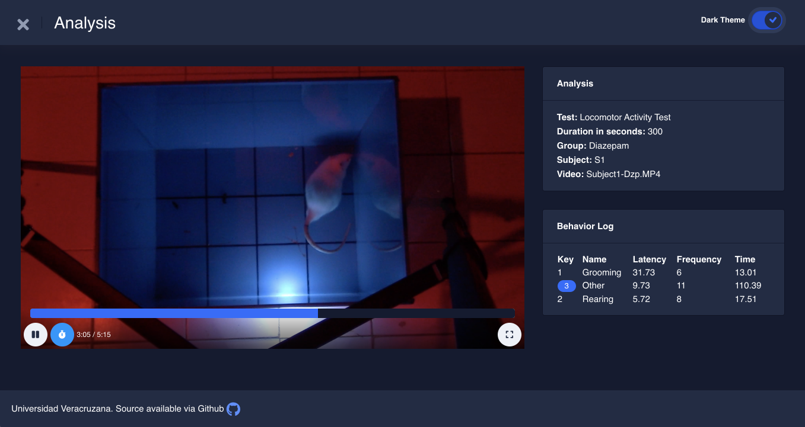
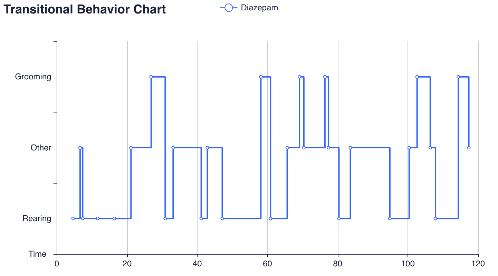

# Summary
In this regard, we introduce UVehavior, and open-source tool that allows researchers to manage, conduct, and compare behavioral observations tests.

# Experimental Design

According to Dugatkin (2020) [@Dugatkin:2020] Behavior is the coordinated responses of whole living organisms to internal and/or external stimuli, considering behavior as an expression of the activity of the nervous system. 
Neuroethology is the branch of neuroscience in charge of finding out which organic components, especially neurophysiological types, are involved in the display of behaviors [@Bassler:1984], the reason why it is interested in the analysis of changes in the frequency, function, and intensity of a certain behavior, which can be modified by different treatments, manipulations or the experience of individuals. For the ethological study, it is important to identify specific behaviors where they will be measured: latency, frequency, and duration [@Inesta:2011].

# Behavioral Observation

On the other hand, before beginning a study on behavior, it is necessary to consider whether the design of the experiment is adequate to allow causal and logical explanations, orienting the investigation towards the adequate data interpretation. The experimental design considers the study subject, conditions of the environment and the control of the variables studied [@Kirk:2012]. In ethology, the behavior was typically categorized by trained observers taking advantage of their experience and intuition to identify relevant elements, however, Tinbergen’s definition leaves open the discussion of how behavior should be measured and represented [@Brown:2018]. 

# References