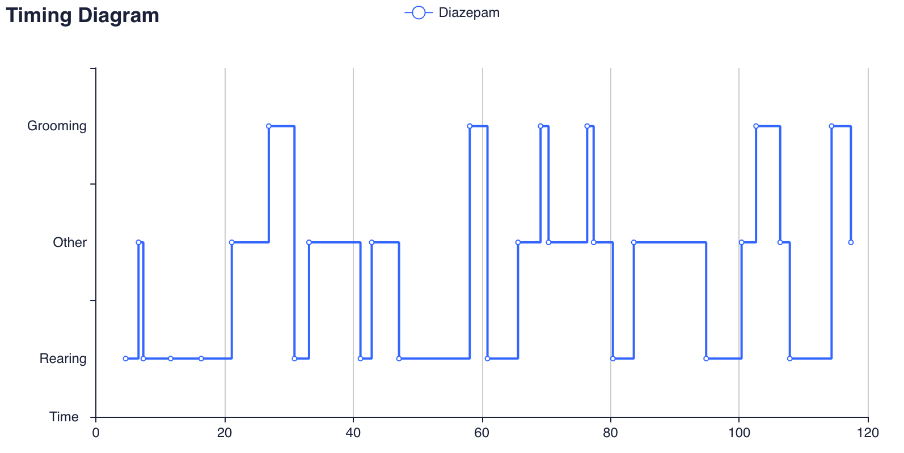

# Summary

Understanding behavior is a relevant task, detecting patterns in how living organisms interact and respond to different stimuli means an area of interest capable of influencing complementary activities in psychology, nutrition, and pharmacology. Research in behavioral science is, however, a high-dimensional problem that involves several activities, from the conceptualization and planning of the study to the analysis of the collected results. Currently, there are several automated software to behavioral analysis, however, they are expensive and limited to the analysis of particular behaviors that only the human eye can identify.
In this regard, we introduce UVehavior, and open-source tool that allows researchers to manage, conduct, and compare behavioral observations in several animals and even the human being.

# Statement of Need

According to @Dugatkin:2020 behavior is the coordinated responses of whole living organisms to internal and/or external stimuli, considering behavior as an expression of the activity of the nervous system.
Neuroethology is an important area of neurosciences involved in the study of the neurobiological, neurochemical, and neurophysiological bases underlying behavior [@Bassler:1984]. Therefore, this science is interested in the quantification of the behavioral changes through the measure of frequency, latency and time duration of specific behavior under normal or altered states induced by drugs, experimental manipulations, or the experience of the individual.

On the other hand, before beginning a study on behavior, it is necessary to consider whether the design of the experiment is adequate to allow causal and logical explanations, orienting the investigation towards the adequate data interpretation. The experimental design considers the study subject, conditions of the environment and the control of the variables studied [@Kirk:2012].

As part of the planning stage, the researcher defines and distributes the groups in which the subjects of study are going to be evaluated. Is by their belonging group that the individuals are subjected to a treatment, for further analysis of the effects on their behavior [@Kirk:2012]. UVehavior allows the researcher to keep track of their subjects, and distribute them by groups, as well as managing the tests to be conducted. In this regard, every test involves a specific amount of time, and a variety of behaviors to be analyzed.

# Behavioral Observation

In ethology, the behavior was typically categorized by trained observers taking advantage of their experience and intuition to identify relevant elements, however, Tinbergen’s definition leaves open the discussion of how behavior should be measured and represented [@Brown:2018].
While conducting the experiment, every subject is recorded during each defined test, where the occurrence of a specific behavior must be logged.

UVehavior assists in this core activity by featuring a suite where the researcher can evaluate their subjects, tests, and behaviors to observe, in one of these test recordings.
The desktop-tool, plays the test video, while the observer analyzes the behavior of the subject. Therefore, every time the subject performs a specific behavior, the researcher logs it by pressing one key previously bound to a behavior.
Besides keeping a record of the behavior logging, UVehavior displays three calculated variables: `latency`, `frequency`, and `duration`. For the ethological study, these measures are important for describing behaviors [@Inesta:2011]. \autoref{fig:annotation} shows the latency, frequency and time spent in grooming and rearing behavior displayed by a Wistar rat subjected to the locomotor activity test [@Fernandez-Demeneghi:2019].

# Analysis of the Results

An additional feature of UVehavior is the ability to display a timing-diagram-like [@Seidl:2015] chart of the behaviors exhibited by a subject during a test. This visualization shows a series of state changes throughout a test, where every behavior evaluated is listed on the vertical axis, whereas the horizontal one represents the chronological order. \autoref{fig:behavior_chart} shows an example of this chart, generated from an evaluated subject.

UVehavior comes from a preliminary version developed _ex profeso_ to conduct the tests' logging for the study by @Fernandez-Demeneghi:2019. However, further additions to the system are planned to turn UVehavior into a set of several tools for the analysis of behavioral observation data.

# References
